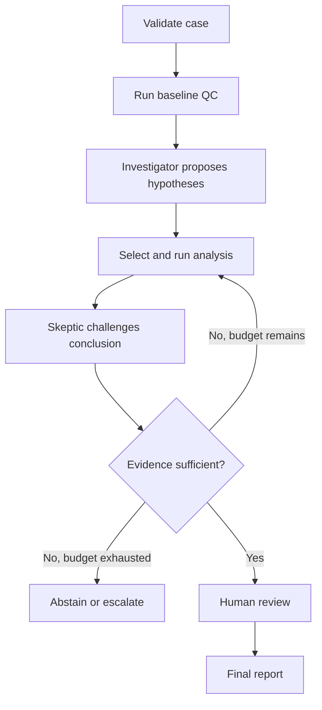

# Agentic Experiment Failure Investigator

## Project description

The **Agentic Experiment Failure Investigator** is an API-driven scientific reasoning system that analyzes a failed biological assay, develops competing explanations, runs appropriate quantitative checks, and recommends the most informative next experiment.

The system accepts a synthetic plate-based assay dataset, plate map, protocol, and short description of the observed problem. It combines deterministic analysis tools with language-model agents that decide what to investigate, interpret tool results, challenge premature conclusions, and determine when the evidence is sufficient for a human review. Its final report presents ranked root-cause hypotheses, evidence for and against each hypothesis, remaining uncertainty, and a recommended follow-up experiment. Every conclusion must be traceable to an input, a tool result, or an explicitly labeled inference.

The project is designed to demonstrate reliable agent engineering in a scientific setting: typed state, tool calling, conditional workflows, bounded iteration, human-in-the-loop review, observability, cost controls, and evaluation against cases with known answers. All assay data and failure scenarios will be generated synthetically, keeping the work separate from proprietary datasets, ontologies, prompts, thresholds, and workflows.

## One-sentence portfolio summary

Built and evaluated an API-driven scientific investigation agent that combines deterministic assay QC with typed multi-agent reasoning, conditional tool use, human review, and evidence-linked recommendations.

## Core learning objective

Learn how agent frameworks orchestrate model API calls and tools inside a stateful application, with particular attention to the difference between:

- A model deciding which action to take
- Application code enforcing workflow and safety constraints
- Deterministic tools producing scientific evidence
- A human deciding whether a recommendation is acceptable

The initial implementation will use **Pydantic AI**. A second implementation will port the orchestration layer to **LangGraph** while preserving the same data, tool contracts, prompts, and evaluation suite. This makes the comparison about orchestration rather than about changes to the scientific problem.

## Architectural requirement: local-model runtime, Codex-assisted development

The primary runtime target is **Ollama serving a Qwen model locally**. Ollama still exposes a model API, so the application exercises real framework-to-model API calls without per-token provider charges. Pydantic AI supports the `ollama:<model>` model form and a local OpenAI-compatible endpoint at `http://localhost:11434/v1`. The initial development model is `ollama:qwen2.5:7b`; changing to another locally installed Qwen tag must be configuration-only.

Codex is the development orchestrator. It may implement code, run tests, inspect traces, rehearse prompts against fixed inputs, and help design adversarial cases. Codex prompt rehearsals are fast development experiments available within the current Codex product allowance; they do not prove that Qwen, Ollama, or the Pydantic AI runtime behaves the same way. Any plan or account limits associated with Codex remain separate from application model usage.

The boundary between development and runtime is deliberate:

| Concern | Owner |
|---|---|
| Implementing, refactoring, and testing the repository | Codex with human review |
| Fast prompt rehearsal and fixture drafting | Codex |
| Reproducible investigation execution | Python application |
| Agent calls and tool registration | Pydantic AI first, LangGraph later |
| Model inference during normal local runs | Ollama with configured Qwen model |
| Scientific calculations | Deterministic Python tools |
| Routing, budgets, retries, and termination | Application code |
| Final acceptance of a recommendation | Human reviewer |

Codex, Claude Code, or another interactive coding agent must not be required to execute, route, or supervise a reproducible application run. In practical terms:

- `uv run experiment-failure-investigator run <case_id>` starts an investigation from a normal shell.
- The selected framework owns the runtime workflow and calls Ollama through a configured client.
- Application state is stored in typed Python objects and, later, a checkpoint store.
- Tools are ordinary Python functions with explicit input and output schemas.
- Every model request records the provider, model tag, configuration, latency, token usage when reported, and estimated monetary cost (`0` for local inference, excluding hardware and electricity).
- Unit tests use deterministic code, `TestModel`, `FunctionModel`, or queued responses and block accidental real model requests.

The model provider must be isolated behind configuration rather than embedded in scientific logic. Ollama/Qwen is the default, while an optional remote provider may be added later for a bounded comparison. Local Ollama needs no API credential; remote-provider credentials, if ever used, must come from environment variables.

### Cost-minimizing development ladder

Use the least expensive validation method capable of answering the current development question:

1. **Pure deterministic tests — no model usage**
   - Validate schemas, state transitions, tools, routing functions, budgets, and termination logic with ordinary unit tests.
   - Use hand-authored fixtures for valid, invalid, incomplete, and contradictory agent outputs.

2. **Codex prompt rehearsal — no separate model-provider token charge**
   - Test candidate system prompts and agent roles against a small set of fixed cases in Codex.
   - Provide representative tool outputs and ask Codex to produce the exact target schema.
   - Record promising prompts and failure examples in version-controlled prompt fixtures.
   - Treat these results as design feedback, not evidence that Qwen or the framework integration works.

3. **Mocked framework runs — no model usage**
   - Use framework test models, stub clients, or queued responses to exercise complete workflows.
   - Confirm tool-call handling, retries, branching, looping, review interruptions, and report generation.

4. **Recorded-response replay — no repeated inference**
   - Save sanitized responses from a small number of real local Ollama runs.
   - Replay them during regression testing so most code changes do not require another model run.
   - Keep replay fixtures free of credentials and sensitive request metadata.

5. **Small live local smoke tests — no provider token charge**
   - Run only three stable golden cases during routine integration testing: one straightforward failure, one ambiguous case, and one clean case.
   - Use the configured local Qwen model through Ollama.
   - Apply strict request, output-token, tool-call, iteration, and timeout limits even though monetary cost is zero.

6. **Milestone evaluation — controlled local compute**
   - Run the complete live benchmark only at major milestones, such as the end of Weeks 3, 4, 5, and 6.
   - Estimate request count and maximum runtime before starting the batch and require explicit configured caps.
   - Reuse the resulting traces for analysis and future regression tests.

7. **Optional remote-model comparison — explicit opt-in only**
   - Add a paid API provider only after the Ollama path and evaluation harness are stable.
   - Estimate the maximum spend and require a configured cost cap plus human approval before each batch.

This strategy preserves the learning goal: Codex accelerates development, while local Ollama runs verify that the implemented agents actually work through the framework and expose the limitations of the chosen Qwen model.

## Intended user experience

### Input

The user provides:

1. A CSV containing measurements from a 96-well assay
2. A plate map describing samples, controls, doses, and replicates
3. Minimal experiment metadata, such as batch, operator, run date, and instrument
4. A generic protocol or assay description
5. A short problem statement, such as “the positive controls were weaker than expected”

### Output

The system produces:

- An input-validation report
- A deterministic QC summary
- Ranked failure hypotheses with calibrated confidence categories
- Evidence supporting and contradicting each hypothesis
- A record of tools called and why they were selected
- Important missing information
- A recommended next analysis or experiment
- A human approval, rejection, or revision record
- A complete machine-readable execution trace

## MVP scientific scope

Use a generic dose-response or cell-viability assay. The synthetic-data generator should create realistic controls, replicates, doses, noise, missing values, and plate-layout effects.

The first benchmark should include six planted failure modes:

1. **Edge effect:** measurements depend on proximity to the plate boundary.
2. **Pipetting drift:** values show a systematic row-wise or column-wise gradient consistent with a dispensing or timing effect. Because actual dispense order will usually be unavailable, the agent must treat pipetting drift as a hypothesis rather than a confirmed cause and keep other spatial explanations in consideration.
3. **Plate-layout confounding:** treatment or dose is confounded with spatial position.
4. **Failed or weak controls:** the positive and negative controls are insufficiently separated.
5. **Batch shift:** one run, operator, reagent lot, or instrument batch differs systematically.
6. **True biological non-response:** QC is acceptable, but the tested condition genuinely lacks the expected effect.

Start with single-cause cases. Add mixed-cause and ambiguous cases only after the single-cause benchmark is reliable.

### Generalization boundary

The balanced 96-well design is an evaluation fixture, not the application's input contract. Application code and prompts must not assume fixed control counts, a shared dose series, equal replicate counts, the presence of a reference treatment, or 96-well geometry. The case loader will derive a typed design and capability summary from each experiment. Tools must either operate on the observed design or return a structured `not_applicable` or `insufficient_data` result.

Before the system is considered complete, the evaluation suite must include format-shift cases such as altered control allocations, unequal replicates, no reference treatment, missing wells, and 384-well plates. This distinguishes genuine scientific reasoning from memorization of the MVP layout.

## System architecture

### Components

1. **Case loader**
   - Loads the measurements, plate map, metadata, protocol, and problem statement.
   - Rejects malformed or internally inconsistent inputs.

2. **Deterministic analysis toolkit**
   - Computes statistics and generates evidence.
   - Never delegates arithmetic or model fitting to the language model.

3. **Investigator agent**
   - Reviews the current state.
   - Proposes competing hypotheses.
   - Selects the next appropriate analysis tool.
   - Updates hypotheses in response to evidence.

4. **Skeptic agent**
   - Tries to falsify the leading explanation.
   - Identifies confounders, unsupported claims, and missing evidence.
   - Can request another analysis but cannot create an unbounded loop.

5. **Workflow controller**
   - Enforces the allowed state transitions.
   - Tracks budgets and iteration counts.
   - Determines whether to continue, abstain, or request human review.

6. **Human-review checkpoint**
   - Allows approval, rejection, modification, or a request for additional analysis.
   - Preserves both the pre-review and post-review state.

7. **Report generator**
   - Produces a concise human-readable report from validated structured state.
   - Links conclusions to evidence identifiers rather than inventing new evidence.

8. **Evaluation harness**
   - Runs the application against labeled synthetic cases.
   - Separately scores scientific accuracy, agent behavior, reliability, latency, and cost.

### Workflow



The workflow should contain both deterministic and agentic transitions. For example, input validation failure should route deterministically, while selection of the next diagnostic tool can be agentic within an explicit allowlist.

## Initial typed data model

The exact fields can evolve, but the project should begin with explicit contracts for the following objects:

### `ExperimentContext`

- Case identifier
- Assay type
- Measurement and plate-map locations
- Control definitions
- Experimental factors
- User-reported symptom
- Available metadata

### `QCFinding`

- Finding identifier
- Analysis tool
- Metric or test
- Observed value
- Reference or expected range, if applicable
- Severity
- Plain-language interpretation
- Source artifact

### `FailureHypothesis`

- Hypothesis identifier
- Proposed mechanism
- Confidence category
- Supporting evidence identifiers
- Contradicting evidence identifiers
- Required missing evidence
- Falsification test

### `ToolRequest`

- Requested tool
- Scientific rationale
- Required parameters
- Hypothesis being tested
- Expected discriminating result

### `InvestigationDecision`

- Status: continue, human review, abstain, or fail
- Leading hypotheses
- Reason for the decision
- Remaining uncertainty
- Recommended next action

### `HumanReview`

- Decision: approve, reject, revise, or request more analysis
- Reviewer comment
- Changed hypothesis ranking, if any
- Timestamp and investigation-state identifier

## Deterministic tool set

Build tools incrementally. The initial set should be small enough that tool selection remains interpretable.

### Required for the MVP

- `validate_plate_map`
- `summarize_controls`
- `calculate_replicate_variability`
- `detect_spatial_effects`
- `fit_dose_response`
- `compare_batches`
- `inspect_missingness`
- `generate_plate_heatmap`

Every tool should:

- Accept a validated input schema
- Return a validated result schema
- Produce stable results for the same inputs
- Return errors as structured data
- Record provenance and runtime
- Be independently unit-tested

## Agent boundaries and safety rules

The language model may:

- Generate and rank hypotheses
- Select from approved analysis tools
- Explain why a tool is relevant
- Interpret validated tool results
- Identify uncertainty and missing evidence
- Recommend a follow-up experiment for human consideration

The language model may not:

- Calculate a reported statistic without a tool
- Invent a result, protocol detail, sample attribute, or quality threshold
- Modify raw data
- Call arbitrary shell or Python code
- Execute a real laboratory action
- Present a conclusion without evidence identifiers
- Continue beyond the configured request, token, cost, or iteration budget

The application should fail closed: invalid structured output triggers a bounded retry, and repeated failure routes to a structured error or abstention rather than free-form continuation.

## Evaluation strategy

Evaluation is part of the core project, not a final polish step.

### Benchmark dataset

Create at least 30 labeled cases:

- 18 straightforward cases: three per failure mode
- 6 noisy but solvable cases
- 3 ambiguous cases where abstention is appropriate
- 3 clean experiments where no technical failure should be inferred

Keep the random seed, planted mechanism, and expected discriminating evidence for every case.

The initial Week 1 slice deliberately reuses one balanced baseline layout for all non-layout-confounding cases. Treat its results as fixed-layout development evidence, not evidence of layout generalization. The layout-confounding cases use deliberately altered maps and test recognition of confounding; they do not substitute for evaluation on unseen balanced layouts.

Before reporting generalization, partition the expanded benchmark by canonical layout fingerprint:

- Use multiple balanced layouts during development.
- Reserve unseen balanced layouts for the final test split and do not tune prompts, tools, thresholds, or deterministic diagnostics on them.
- Include changes in control allocation, replicate count, optional reference treatment, and plate format where scientifically applicable.
- Verify that development and held-out layout fingerprints do not overlap.
- Report metrics separately for fixed-layout development cases, held-out layouts, layout-confounding cases, and 96-to-384-well format shifts.

### Scientific metrics

- Correct root cause ranked first
- Correct root cause present in the top three
- False positive rate on clean experiments
- Appropriate abstention on ambiguous cases
- Evidence precision: fraction of cited evidence that genuinely supports the associated claim
- Evidence coverage: fraction of important deterministic findings reflected in the conclusion
- Follow-up utility: whether the recommended test distinguishes the leading hypotheses

### Agent-system metrics

- Structured-output validation rate
- Correct tool-selection rate
- Unnecessary tool calls per case
- Unsupported claims per report
- Termination success rate
- Budget violations
- Human-override rate
- API requests, tokens, latency, and estimated cost per case

### Ablations

Compare:

1. Deterministic QC report only
2. Investigator without skeptic
3. Investigator plus skeptic
4. Investigator plus skeptic and human checkpoint
5. Pydantic AI orchestration versus LangGraph orchestration

Use deterministic labels and expert review as the primary evaluation. An LLM judge may be included as a secondary exploratory measure, but it should not be treated as ground truth.

## Six-week implementation plan

This schedule assumes approximately 6–8 focused hours per week. It can be compressed or expanded without changing the milestone structure.

### Week 1 — Define the scientific benchmark

**Goals**

- Freeze the MVP assay type and seven failure mechanisms.
- Specify the input formats and expected outputs.
- Build the first version of the synthetic-data generator.

**Tasks**

- Define a simple 96-well dose-response design.
- Implement clean-data generation.
- Implement the seven failure injectors.
- Create deterministic labels and case manifests.
- Manually inspect one example of each failure type.

**Deliverable**

- Twelve initial cases: one obvious and one noisy example per failure type.
- A short benchmark specification describing how every failure is generated.
- A deterministic generator test suite and saved inspection plots.
- The executable plan in [`week_1_implementation_plan.md`](week_1_implementation_plan.md).

**Exit criterion**

- A knowledgeable reviewer can identify the planted failure from the raw data and baseline plots.

### Week 2 — Build typed tools and baseline QC

**Goals**

- Separate scientific computation from model reasoning.
- Establish the typed contracts used by both framework implementations.

**Tasks**

- Implement the Pydantic models.
- Implement input validation.
- Build and test the initial deterministic tools.
- Create a non-agentic baseline report.
- Add stable evidence identifiers and provenance.

**Deliverable**

- A CLI that produces a deterministic QC report for any valid benchmark case.

**Exit criterion**

- Every reported number originates in a tested function and can be traced to its inputs.

### Week 3 — Ollama-backed Pydantic AI investigator

**Goals**

- Make the first real local Ollama API calls from application code.
- Implement typed agent outputs and bounded tool use.

**Tasks**

- Configure `ollama:qwen2.5:7b` as the initial model through environment or configuration, including `OLLAMA_BASE_URL=http://localhost:11434/v1`.
- Implement the investigator agent.
- Expose only the approved deterministic tools.
- Add output validation, bounded retries, and usage limits.
- Log the prompt version, model configuration, tool calls, tokens, latency, and cost.
- Rehearse and refine prompts in Codex using fixed representative cases, then test the same fixtures against Qwen.
- Implement mocked-model workflow tests and recorded-response replay.
- Run live local integration tests only on the three-case smoke-test set during routine development.

**Deliverable**

- `uv run experiment-failure-investigator run <case_id>` executes a complete investigation through Pydantic AI and local Ollama.

**Exit criterion**

- The application runs outside Codex or any other coding-agent session and produces a validated machine-readable trace.
- Routine development and regression tests can run without model inference; live local tests incur no model-provider token charge.

### Week 4 — Skeptic, iteration, and human review

**Goals**

- Add meaningful multi-agent behavior.
- Make uncertainty and stopping decisions explicit.

**Tasks**

- Add the skeptic agent.
- Require the skeptic to target the leading hypothesis's weakest point.
- Add a bounded investigate–challenge loop.
- Implement continue, abstain, escalate, and review states.
- Add a local human-review interface, initially through the CLI or a minimal web form.
- Preserve state before and after review.

**Deliverable**

- A resumable investigation with a visible review checkpoint.

**Exit criterion**

- No workflow can exceed its configured iteration or API budget, and every terminal state has an explicit reason.

### Week 5 — LangGraph orchestration port

**Goals**

- Learn explicit graph-based state and routing.
- Compare framework behavior without changing the scientific components.

**Tasks**

- Reuse the same Pydantic schemas and deterministic tools.
- Represent the workflow as LangGraph nodes and conditional edges.
- Add checkpointing and interruption at human review.
- Verify state restoration after an intentional interruption.
- Run identical cases through both implementations.

**Deliverable**

- Two runnable backends selected through configuration: `pydantic_ai` and `langgraph`.

**Exit criterion**

- Both backends accept the same case format and produce the same final output schema.

### Week 6 — Evaluation and portfolio packaging

**Goals**

- Determine whether agentic components provide measurable value.
- Turn the work into an inspectable portfolio project.

**Tasks**

- Expand the benchmark to at least 30 cases.
- Add multiple balanced layout families and a fingerprint-disjoint held-out layout split before evaluating layout generalization.
- Estimate and cap the local evaluation request count and runtime before execution; estimate monetary cost only for an explicitly enabled remote comparison.
- Run all planned ablations as a controlled milestone batch.
- Analyze accuracy, failure modes, request count, token usage, runtime, latency, and monetary cost when applicable.
- Document at least three cases where the agent fails or abstains.
- Create an architecture diagram and example execution trace.
- Write a concise technical report and a reproducible quickstart.

**Deliverable**

- Public repository, evaluation report, and short demo.

**Exit criterion**

- A reviewer can reproduce the benchmark, inspect a trace, understand the agent boundaries, distinguish fixed-layout from held-out-layout evidence, and see quantitative evidence about whether the skeptic and graph orchestration helped.

## Suggested repository structure

```text
experiment-failure-investigator/
├── README.md
├── pyproject.toml
├── .env.example
├── configs/
│   ├── models.yaml
│   └── budgets.yaml
├── src/experiment_failure_investigator/
│   ├── cli.py
│   ├── config.py
│   ├── schemas.py
│   ├── tools/
│   ├── agents/
│   ├── workflows/
│   │   ├── pydantic_ai_workflow.py
│   │   └── langgraph_workflow.py
│   ├── reporting/
│   └── telemetry/
├── cases/
├── evaluations/
│   ├── metrics.py
│   ├── ablations.py
│   └── expected_results/
├── tests/
│   ├── unit/
│   ├── integration/
│   └── golden_cases/
└── docs/
    ├── architecture.md
    ├── benchmark_spec.md
    ├── case_manifest.schema.json
    ├── evaluation_report.md
    └── proprietary_boundaries.md
```

The synthetic generator, failure injectors, and benchmark contracts live under `src/experiment_failure_investigator/benchmark/`, as specified in the Week 1 plan.

## Model API and configuration design

Default local configuration:

- Provider: `ollama`
- Model identifier: `qwen2.5:7b` initially, configurable without code changes
- Pydantic AI model string: `ollama:qwen2.5:7b`
- Base URL: `http://localhost:11434/v1`
- Monetary inference cost: `0`, recorded separately from runtime and local resource usage

Use configuration fields such as:

- Provider
- Model identifier
- Temperature or equivalent sampling settings
- Maximum output tokens
- Maximum requests per investigation
- Maximum tool calls per investigation
- Maximum investigation cost
- Maximum evaluation-batch cost
- Maximum wall-clock time per investigation and evaluation batch
- Retry count
- Request timeout
- Prompt-version identifier
- Runtime mode: mock, replay, local, smoke, evaluate, or remote

The local Ollama path requires no API credential. Any future remote-provider credentials should be loaded from environment variables and excluded from version control. Commit an `.env.example` containing variable names and safe local defaults only.

For reproducibility, every run record should include:

- Application commit identifier
- Framework and version
- Model provider and model identifier
- Prompt versions
- Tool versions
- Case identifier and dataset hash
- Sampling configuration
- Full validated state transitions
- Token usage, latency, and estimated cost

### Suggested test modes

Provide explicit commands or configuration profiles for six modes:

- **`mock`**: deterministic queued responses; used for unit and workflow tests.
- **`replay`**: previously recorded, sanitized API responses; used for regression tests.
- **`local`**: live calls to local Ollama for one named development case with hard request and timeout limits.
- **`smoke`**: live local Ollama calls against three golden cases with small request, token, iteration, and timeout caps.
- **`evaluate`**: live local Ollama calls against the selected benchmark and ablations, requiring an estimated request count, runtime ceiling, and configured caps.
- **`remote`**: optional paid-provider comparison, disabled by default and requiring an estimated batch cost, configured dollar cap, and explicit approval.

Prompt experiments performed interactively in Codex should be recorded as development notes or fixtures, but they remain distinct from application runtime modes and must be rerun against Qwen before being accepted.

## Framework-learning progression

### Pydantic AI first

Use Pydantic AI to learn:

- Typed dependencies and outputs
- Tool registration
- Validation and retry behavior
- Usage limits
- Agent delegation
- Test models and API-level integration testing

Do not begin with a graph. First make the single investigator reliable, then add the skeptic and explicit application-controlled handoff. Pydantic AI's own documentation describes a progression from single-agent workflows through delegation, programmatic handoffs, graphs, and deeper agents, and cautions that graphs add unnecessary machinery when simpler control flow is sufficient: [Pydantic AI multi-agent applications](https://pydantic.dev/docs/ai/guides/multi-agent-applications/) and [Pydantic Graph](https://pydantic.dev/docs/ai/graph/graph/).

### LangGraph second

Use LangGraph when the project actually needs:

- Explicit state transitions
- Conditional cycles
- Persistent checkpoints
- Interruption and resumption
- Human modification of state
- A visualizable workflow topology

These are central design goals of LangGraph rather than incidental features: [LangGraph overview](https://docs.langchain.com/oss/python/langgraph/overview).

### Optional later comparison

After the six-week core project, port only the investigator–skeptic collaboration to CrewAI or AutoGen. Use the same benchmark and output schemas. This should be treated as an experiment about orchestration abstractions, not as a third production implementation. AutoGen's GraphFlow currently supports branching, parallel execution, and loops, but its official documentation labels the feature experimental: [AutoGen GraphFlow](https://microsoft.github.io/autogen/stable/user-guide/agentchat-user-guide/graph-flow.html).

## Definition of done

The project is complete when:

- It runs through local Ollama's documented model API from a normal Python process.
- It does not require Codex or another interactive coding agent at runtime.
- Prompt development can be rehearsed rapidly in Codex and verified against the configured local Qwen model.
- Mock and replay modes exercise the complete workflow without model inference.
- Local, smoke, and evaluation modes use Ollama/Qwen by default and enforce explicit request, token, iteration, and timeout limits.
- At least 30 labeled synthetic cases can be generated reproducibly.
- All scientific calculations are performed by deterministic, tested tools.
- All model outputs crossing component boundaries are schema-validated.
- Every conclusion cites evidence identifiers.
- Iterations, tool calls, tokens, and cost are bounded.
- Ambiguous cases can terminate with abstention.
- Human review can modify or reject a recommendation.
- Pydantic AI and LangGraph implementations share the same scientific tools and output schema.
- The repository reports both successes and failure cases.
- A new user can reproduce at least one investigation from the README.

## Proprietary-work separation

The public repository should state that:

- All data and scenarios are synthetic.
- The project does not reproduce a former employer's datasets, code, schemas, ontologies, prompts, ranking criteria, quality thresholds, user interfaces, or workflow topology.
- The project does not nominate therapeutic targets, assess regulatory-submission completeness, or generate biologic candidates.
- Generic scientific methods are implemented from public references and independently designed specifications.

Keep a brief design log recording the public source or independent rationale for major scientific and architectural decisions. This provides a useful intellectual audit trail as well as protection against accidental reuse.

## Stretch goals

Pursue these only after the benchmark and evaluation harness are stable:

- Mixed-cause failures
- Active selection of the next synthetic experiment
- Multiple assay types
- A small Streamlit or FastAPI interface
- Model-provider comparison
- An OpenTelemetry-compatible trace viewer
- A local MCP server exposing the deterministic analysis tools
- A third orchestration comparison using CrewAI or AutoGen
- A lightweight natural-language explanation tailored separately to a bench scientist and a data scientist

## Recommended first task

Execute [`week_1_implementation_plan.md`](week_1_implementation_plan.md) before writing agent code. Define the clean plate model, implement the seven failure injectors, test reproducibility and invariants, and document the evidence that should discriminate each failure. The quality of those cases will determine whether the eventual agent can be evaluated scientifically rather than demonstrated anecdotally.

## Primary implementation references

- [Pydantic AI: Ollama](https://pydantic.dev/docs/ai/models/ollama/)
- [Pydantic AI: unit testing](https://pydantic.dev/docs/ai/guides/testing/)
- [Ollama API introduction](https://docs.ollama.com/api/introduction)
